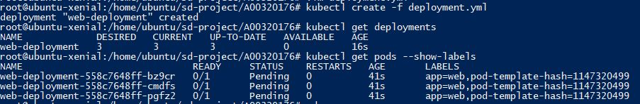
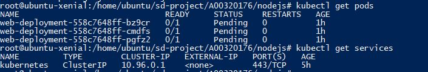
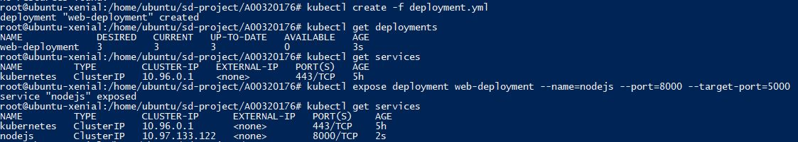
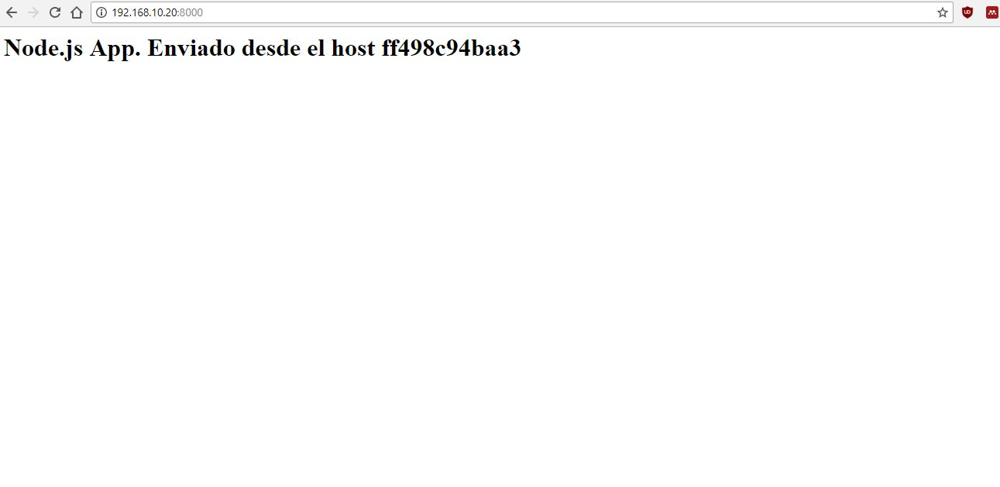

# Proyecto - Daniel Gutierrez A0320176

## Comandos necesarios

Para iniciar el pod con las replicas necesarias se debe ejecutar el comando


`kubectl run web-deployment --image=dgutierrez64/nodejs --replicas=3 --port=5000 --labels=app=web`

Otos comandos necesarios en la inicializacion




Para exponer el servicio se utiliza

`kubectl expose deployment web-deployment --name=nodejs --port=8000 --target-port=5000`



## Archivos Dockerfile para los servicios empleados

Se creo una imagen que hace uso de un servidor Node.js. La imagen se creo a partir de la imagen node:carbon y se le agrego los archivos del servidor y se instalaron las dependencias

El codigo del servidor `server.js`
```js
const express = require('express')
const app = express()
const os = require('os')
const PORT = 5000

app.get('/', (req, res) => res.send("<h1>Node.js App.  Enviado desde el host " + os.hostname() + "</h1>"))

app.listen(PORT, () => console.log("Aplicacion corriendo en el puerto " + PORT + "!" ))
```

El archivo `package.json` para declarar informacion, scripts y dependencias de la aplicacion.
```json
{
  "name": "docker_web_app",
  "version": "1.0.0",
  "description": "Node.js app para Docker y Kuberneter",
  "author": "Daniel Gutierrez <d.aguti@hotmail.com>",
  "main": "server.js",
  "scripts": {
    "start": "node server.js"
  },
  "dependencies": {
    "express": "^4.16.1"
  }
}
```

Se automatizo la creacion del contenedor de la aplicacion en el archivo Dockerfile
```Dockerfile
FROM node:carbon
ADD . /code
WORKDIR /code
RUN npm install
EXPOSE 5000
CMD ["npm", "start"]
```

Se creo la imagen a partir de este `Dockerfile` y se subio a Docker Cloud usando:
```bash
docker build -t dgutierrez64/nodejs .
docker login
docker tag dgutierrez64/nodejs dgutierrez64/nodejs
docker push dgutierrez64/nodejs
```


## Archivos de configuración necesarios

#### deployment.yml

```yml
apiVersion: apps/v1beta1
kind: Deployment
metadata:
  name: web-deployment
spec:
  replicas: 3
  template:
    metadata:
      labels:
        app: web
    spec:
      containers:
      - name: web
        image: dgutierrez64/nodejs
        ports:
        - containerPort: 5000
```
#### service.yaml
```yml
apiVersion: v1
kind: Service
metadata:
  name: nodejs
spec:
  ports:
  - port: 8000
    targetPort: 5000
    protocol: TCP
  selector:
    app: web
```

Funcionamiento de la aplicacion 


## Problemas

Uno de los problemas mas importantes que se presentaron en el desarrollo del proyecto fue durante la ejecucion de los pods estos permanecian en estado PENDING, esto ocurrio por falta de memoria en el equipo. Dado que nativamente en mi equipo no esta funcionando Docker ni Kubernentes, tuve que crear una maquina con Vagranta y a trabajar ahi por medio de la consola y de VIM. Esta maquina, por problemas del equipo se el asigno poca memoria, insuficiente para que se pudiera ejecutar bien el cluster.

